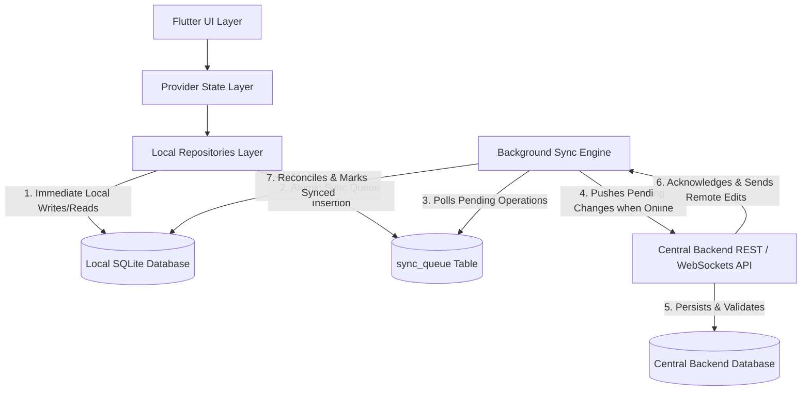
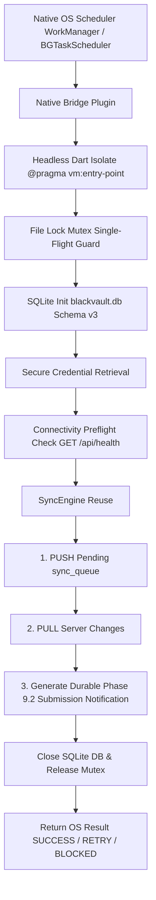

# BlackVault — Phase 8.1: Offline-First Architecture & Sync Model Specification

---

## Executive Overview

This document specifies the **Offline-First Architecture & Synchronization System** for **BlackVault**, building directly upon the Phase 7 SQLite database foundation (`blackvault.db`).

BlackVault operates under the fundamental principle:
> **Local SQLite remains the application's primary operational database on the device.**

The Flutter application executes all reads and writes immediately against local SQLite, providing instant user interface feedback and full offline functionality. Synchronization with the central backend operates asynchronously in the background whenever network connectivity is available.

---

## 1. Current Phase 7 Architecture (Grounded Analysis)

### 1.1 Local SQLite Database (`DatabaseService`)
- **Location**: [`lib/services/database_service.dart`](file:///d:/LOAN_REQUEST_AG/lib/services/database_service.dart)
- **Database File**: `blackvault.db` (Version 1)
- **Platform Initialization**: Uses native `sqflite` on mobile (Android/iOS) and `sqflite_common_ffi` on desktop (Windows, macOS, Linux).
- **Core Schema**:
  - `users`: `id`, `fullName`, `email`, `phone`, `role`, `passwordHash`, `createdAt`
  - `loans`: `id`, `userId`, `userName`, `amount`, `tenureMonths`, `purpose`, `priority`, `status`, `createdAt`
  - `loan_activities`: `id`, `loanId`, `userId`, `userName`, `type`, `message`, `createdAt`
  - `notifications`: `id`, `userId`, `title`, `message`, `type`, `loanId`, `createdAt`, `isRead`
  - **Indexes**: `idx_loans_userId`, `idx_loans_status`, `idx_loan_activities_loanId`, `idx_loan_activities_userId`, `idx_notifications_userId`, `idx_notifications_loanId`.

### 1.2 Persistence Repositories & Data Flow
- **`LocalLoanRepository`** ([`lib/repositories/loan_repository.dart`](file:///d:/LOAN_REQUEST_AG/lib/repositories/loan_repository.dart)): SQLite CRUD operations (`getAllLoans`, `getUserLoans`, `getLoanById`, `createLoan`, `updateLoanStatus`, `deleteLoan`). Seed data (`LOAN-1001`, `LOAN-1002`) initializes automatically on fresh databases.
- **`LocalLoanActivityRepository`** ([`lib/repositories/loan_activity_repository.dart`](file:///d:/LOAN_REQUEST_AG/lib/repositories/loan_activity_repository.dart)): Append-only activity logs stored in `loan_activities`.
- **`LocalNotificationRepository`** ([`lib/repositories/notification_repository.dart`](file:///d:/LOAN_REQUEST_AG/lib/repositories/notification_repository.dart)): System & loan notifications stored in `notifications` with `isRead` integer mapping (`0` / `1`).
- **`MigrationService`** ([`lib/services/migration_service.dart`](file:///d:/LOAN_REQUEST_AG/lib/services/migration_service.dart)): One-time atomic migration from legacy `SharedPreferences` JSON strings into SQLite.

### 1.3 State Management & Callers
- **`LoanProvider`** ([`lib/providers/loan_provider.dart`](file:///d:/LOAN_REQUEST_AG/lib/providers/loan_provider.dart)): Orchestrates business actions (`createLoan`, `updateLoanStatus`, `cancelLoan`) across `LoanRepository`, `LoanActivityRepository`, and `NotificationRepository`.
- **Current Offline Behavior**: 100% functional on a single device using local SQLite.
- **Current Limitations**: No central backend synchronization exists. Data created on Device A (e.g. customer loan request) is isolated locally and not visible to Admin or other devices. Admin status approvals are local to that device.

---

## 2. Target Phase 8 Offline-First Architecture



### Layer Responsibilities

1. **Flutter UI & Provider Layer**:
   - Renders application screens instantly from local Provider state.
   - Remains completely unaware of network connectivity or synchronization delays.
2. **Local Repositories Layer**:
   - Performs immediate SQLite reads and writes.
   - Enqueues outgoing operations into `sync_queue` atomically during business writes.
3. **Local SQLite Database (`blackvault.db`)**:
   - Primary operational database on the device.
   - Contains business tables + `sync_queue` metadata table.
4. **Background Sync Engine**:
   - Monitors network connectivity using `connectivity_plus` / HTTP heartbeats.
   - Pulls pending operations from `sync_queue`, batches requests, and calls Backend API.
   - Receives server-side updates and applies them transactionally to local SQLite tables.
5. **Central Backend & Database**:
   - Central authority for cross-device data validation, identity verification, authorization, and broadcast updates to other connected devices/admin panels.

---

## 3. Entity Ownership Matrix

| Entity | Stored in Local SQLite | Stored in Server Backend | Primary Entity Owner | Sync Direction | Conflict Authority |
| :--- | :--- | :--- | :--- | :--- | :--- |
| **Customer Profile** | Yes (`users` table / session) | Yes | Customer | Bidirectional | Customer (profile) / Server (roles) |
| **Loan Application Fields** (`amount`, `tenureMonths`, `purpose`, `priority`) | Yes (`loans` table) | Yes | Customer | Device → Server (when `pending`) | Customer Device (if status is `pending`) |
| **Loan Application Status** (`status`) | Yes (`loans.status`) | Yes | Admin / Management | Server → Customer Device | **Server / Admin ALWAYS Overrides** |
| **Loan Activity Log** | Yes (`loan_activities` table) | Yes | System / Admin / Customer | Bidirectional (Append-Only) | Merge by `createdAt` timestamp |
| **Notifications** | Yes (`notifications` table) | Yes | Server (creation) / Customer (`isRead`) | Bidirectional | Server (creation) / Customer (`isRead` state) |

---

## 4. Synchronization States

Each local record and sync operation moves through explicit, well-defined lifecycle states:

```
  [User Action Offline]
           │
           ▼
     ┌───────────┐
     │ LOCAL_ONLY│  (Created offline, pending initial server push)
     └─────┬─────┘
           │ Network Connected
           ▼
     ┌───────────┐
     │SYNCING    │  (In flight to backend API)
     └─────┬─────┴────────┐
           │              │
    Server Acknowledged  Server Error / Offline
           │              │
           ▼              ▼
     ┌───────────┐  ┌───────────┐
     │  SYNCED   │  │SYNC_FAILED│ ──(Retry with backoff)──► SYNCING
     └───────────┘  └───────────┘
```

### Detailed State Definitions

1. **`LOCAL_ONLY`**:
   - **Meaning**: Record created on the device while offline. Assigned a client-generated UUID.
   - **Transitions**: Created by local repository write -> Transitions to `SYNCING` when network engine initiates upload.
2. **`PENDING_SYNC`**:
   - **Meaning**: Existing synced record modified locally (or queued operation waiting for network window).
   - **Transitions**: Local edit -> Transitions to `SYNCING` upon transmission attempt.
3. **`SYNCING`**:
   - **Meaning**: Operation actively being transmitted to the central backend.
   - **Transitions**: Enters from `LOCAL_ONLY`, `PENDING_SYNC`, or `SYNC_FAILED`. Moves to `SYNCED` on HTTP `200/201 OK`, or `SYNC_FAILED` on network/server error.
4. **`SYNCED`**:
   - **Meaning**: Local record state is identical to server authoritative state.
   - **Transitions**: Enters upon server acknowledgment or server pull insertion.
5. **`SYNC_FAILED`**:
   - **Meaning**: Transmission failed due to network loss, timeout, or server 5xx error.
   - **Transitions**: Enters from `SYNCING`. Retried automatically using exponential backoff back to `SYNCING`.
6. **`CONFLICT`**:
   - **Meaning**: Server rejected change due to business rule validation or concurrent edit.
   - **Transitions**: Enters from `SYNCING` on HTTP `409 Conflict`. Resolved via Field Ownership Rules (e.g. Admin status override) transitioning to `SYNCED`.

---

## 5. Identity Strategy & Multi-Device Collision Prevention

### 5.1 Globally Unique Identifiers (UUID v4)
- Current local IDs (e.g. `LOAN-1001`, `LOAN-1002`, `NOTIF-1`) are supplemented/replaced with **UUID v4** strings (e.g. `550e8400-e29b-41d4-a716-446655440000` or prefixed `LOAN-550e8400-e29b-41d4-a716-446655440000`).
- **Why Auto-Increment / Short IDs are Insufficient**: If Device A creates `LOAN-1003` offline and Device B creates `LOAN-1003` offline, uploading both to the central server causes primary key collisions. UUID v4 guarantees global uniqueness across independent offline devices without central coordination.

### 5.2 Device Identifier (`deviceId`)
- Generated on first app launch using UUID v4.
- Stored persistently in `SharedPreferences` (`key_device_id`).
- Attached to all sync request headers (`X-Device-ID: <deviceId>`).
- **Purpose**: Server includes `originDeviceId` in WebSocket / Pull responses so the originating device ignores its own pushed changes during pull reconciliation (echo prevention).

---

## 6. Synchronization Metadata Schema

To maintain clean separation between domain models and synchronization concerns, metadata is stored directly in SQLite tables:

| Metadata Field | Belongs To | Data Type | Purpose / Description |
| :--- | :--- | :--- | :--- |
| `id` | Domain / Sync | `TEXT PRIMARY KEY` | Globally unique UUID v4 identifier. |
| `serverId` | Sync Layer | `TEXT` | Server-assigned database ID (if different from client UUID). |
| `deviceId` | Sync Layer | `TEXT` | ID of the device that created/modified the record. |
| `syncStatus` | Sync Layer | `TEXT` | `LOCAL_ONLY`, `PENDING_SYNC`, `SYNCING`, `SYNCED`, `SYNC_FAILED`, `CONFLICT`. |
| `createdAt` | Domain / Sync | `TEXT (ISO-8601)` | Timestamp when the record was created locally. |
| `updatedAt` | Domain / Sync | `TEXT (ISO-8601)` | Timestamp when record fields were last modified. |
| `lastSyncedAt` | Sync Layer | `TEXT (ISO-8601)` | Timestamp of last successful server acknowledgment. |
| `version` | Sync Layer | `INTEGER` | Monotonically increasing version number for optimistic concurrency control. |
| `isDeleted` | Sync Layer | `INTEGER (0/1)` | Soft deletion flag allowing deletion sync across devices. |

---

## 7. Sync Queue Table Architecture (`sync_queue`)

Offline mutations are tracked using a dedicated, persistent SQLite table: `sync_queue`.

### 7.1 Schema Definition
```sql
CREATE TABLE IF NOT EXISTS sync_queue (
  id TEXT PRIMARY KEY,
  entityType TEXT NOT NULL,         -- 'loan', 'loan_activity', 'notification'
  entityId TEXT NOT NULL,           -- Target entity primary key
  operation TEXT NOT NULL,          -- 'CREATE', 'UPDATE', 'DELETE'
  payload TEXT NOT NULL,            -- JSON serialized string of operation data
  clientOperationId TEXT NOT NULL,  -- Unique key for backend idempotency
  createdAt TEXT NOT NULL,          -- Timestamp queued
  retryCount INTEGER NOT NULL DEFAULT 0,
  lastAttemptAt TEXT,
  status TEXT NOT NULL DEFAULT 'PENDING_SYNC', -- 'PENDING_SYNC', 'SYNCING', 'SYNC_FAILED'
  error TEXT
);

CREATE INDEX IF NOT EXISTS idx_sync_queue_status ON sync_queue(status);
CREATE INDEX IF NOT EXISTS idx_sync_queue_createdAt ON sync_queue(createdAt);
```

### 7.2 Queue Lifecycle & Retry Mechanics
1. **Enqueue**: During business operations (e.g. `createLoan`), an entry is inserted into `sync_queue` in the **same SQLite transaction** as the business record update.
2. **Processing**: When connectivity is active, the `SyncEngine` queries `SELECT * FROM sync_queue WHERE status IN ('PENDING_SYNC', 'SYNC_FAILED') ORDER BY createdAt ASC`.
3. **Execution**: Operation status is marked `SYNCING` and sent to the REST API.
4. **Completion**: Upon HTTP `200/201 OK`, the queue entry is deleted from `sync_queue` (or marked completed) and the target entity's `syncStatus` is updated to `SYNCED`.
5. **Retry Handling**: On failure, `retryCount` is incremented, `lastAttemptAt` is updated, `status` becomes `SYNC_FAILED`, and retries execute using **exponential backoff** ($2^n \times 5$ seconds, capped at 15 minutes).

---

## 8. Complete Synchronization Lifecycle

```
[User Action in UI]
       │
       ▼
[SQLite Transaction] ──(1. Save Entity)───────► [loans / activities / notifications Table]
       │
       └───(2. Save Queue Entry)──► [sync_queue Table (status: PENDING_SYNC)]
       │
[UI Updates Instantly]
       │
[Network Connection Restored]
       │
       ▼
[SyncEngine Background Task]
       │
       ├──► Sets queue status to SYNCING
       ├──► POST /api/v1/sync/push (Payload + clientOperationId + X-Device-ID)
       │
  ┌────┴────────────────────────┐
  ▼                             ▼
[Server Validation OK]    [Network Error / Timeout]
  │                             │
  ├──► 200 OK Received          ├──► Increment retryCount
  ├──► Delete sync_queue entry  ├──► Set status = SYNC_FAILED
  ├──► Mark entity SYNCED       └──► Schedule Exponential Backoff Retry
  │
  ▼
[SyncEngine Pull Phase]
  │
  ├──► GET /api/v1/sync/pull?since=<lastSyncedAt>
  ├──► Apply server updates to local SQLite transactionally
  └──► Update lastSyncedAt timestamp
```

---

## 9. Conflict Resolution Strategy (Field-Level Ownership)

BlackVault avoids naive "Last Write Wins" by enforcing **Field Ownership Rules**:

### 9.1 Ownership Matrix Rules
1. **Customer-Owned Fields** (`amount`, `tenureMonths`, `purpose`, `priority`):
   - Customer devices have authority.
   - If the application `status` is `pending`, customer edits uploaded from offline devices overwrite server values.
2. **Admin-Owned Fields** (`status`):
   - Backend / Admin actions have **absolute authority**.
   - If an Admin approves (`status = approved`) or rejects (`status = rejected`) a loan on the server, a customer's offline cancellation or edit request for that loan is rejected by the server with `409 Conflict`. The client database accepts the Admin's final `status`.
3. **Append-Only Event Logs** (`loan_activities`, `notifications`):
   - Activities and notifications are immutable append-only logs.
   - Merged across devices by unique `id` and `createdAt` timestamps.

---

## 10. Transaction Safety Rules

To guarantee that a local business update is **never permanently unsynchronized**, SQLite transactions must encompass both business table updates and `sync_queue` entries atomically:

```dart
// Conceptual Transaction Pattern for Repositories in Phase 8
await db.transaction((txn) async {
  // 1. Update business table
  await txn.insert('loans', loan.toJson(), conflictAlgorithm: ConflictAlgorithm.replace);

  // 2. Insert sync queue operation atomically
  await txn.insert('sync_queue', {
    'id': 'QUEUE-${UUID.v4()}',
    'entityType': 'loan',
    'entityId': loan.id,
    'operation': 'CREATE',
    'payload': jsonEncode(loan.toJson()),
    'clientOperationId': 'OP-${UUID.v4()}',
    'createdAt': DateTime.now().toIso8601String(),
    'status': 'PENDING_SYNC',
  });
});
```

If the device powers off or crashes mid-write, **both** operations roll back together, maintaining perfect consistency.

---

## 11. Idempotency Strategy (`clientOperationId`)

To prevent duplicate requests when network retries occur (e.g., client sends upload, server processes and saves record, but HTTP response drops before reaching client):

1. **Client Generation**: Each queue operation generates a unique `clientOperationId` (UUID v4).
2. **Transmission**: Sent in the payload of every HTTP request.
3. **Server Validation**: The central backend stores processed `clientOperationId` entries in a deduplication cache/table.
4. **Duplicate Handling**: If the server receives a request with an already-processed `clientOperationId`, it skips re-inserting the record and returns `200 OK` with the cached result.

---

## 12. Network Failure & Edge-Case Fault Tolerance

| Scenario | Application Behavior |
| :--- | :--- |
| **No Internet** | Local write succeeds instantly in SQLite. Operation queued as `PENDING_SYNC`. UI functions normally. |
| **Intermittent / Poor Signal** | Request times out. `SyncEngine` catches timeout, sets queue status `SYNC_FAILED`, and schedules exponential backoff. |
| **Connection Drops Mid-Upload** | Server may or may not have received request. Retry uses same `clientOperationId` so server deduplicates safely. |
| **Connection Drops Mid-Download (Pull)** | Client SQLite transaction has not committed pull batch. Rollback occurs cleanly; next pull resumes from previous `lastSyncedAt`. |
| **Server 500 / Unavailable** | Queue item marked `SYNC_FAILED`. Local data preserved. Exponential backoff delays next attempt. |
| **Device Restart / App Killed** | Queue items persist in SQLite `sync_queue` table across restarts and resume automatically on next boot. |

---

## 13. Security & Authorization Architecture

1. **Authentication**: JWT access tokens & refresh tokens stored securely.
2. **Customer Data Isolation**: Backend enforces row-level security: Customers can only query/sync loans where `userId == token.userId`.
3. **Admin Authorizations**: Only JWT tokens with `role == 'admin'` can mutate loan `status` to `approved` or `rejected`.
4. **TLS Encrypted Transport**: All sync traffic transmitted strictly over `HTTPS` / `WSS`.
5. **Device Identity**: `deviceId` identifies the physical installation but is never used as an authentication credential.

---

## 14. Phase 8 Implementation Roadmap

- **Phase 8.1**: Architecture & Sync Model Specification (Documentation).
- **Phase 8.2 — Backend Foundation**: REST API & Database setup for central backend (Users, Loans, Activities, Notifications, Argon2id, JWT, Sync endpoints).
- **Phase 8.3 — Local Sync Queue**: Added `sync_queue` table to `DatabaseService` schema (version 2 with migration), created `LocalSyncQueueRepository` & `SyncQueueItem` model, and updated local repositories (`LocalLoanRepository`, `LocalLoanActivityRepository`, `LocalNotificationRepository`) to record mutations atomically inside SQLite transactions.
- **Phase 8.4 — Push Synchronization**: Created `SyncEngine` in `lib/services/sync_engine.dart` and implemented `SyncBackendController` at `POST /api/sync/push`. Enforces `clientOperationId` idempotency, role-based access control, and field ownership validation.
- **Phase 8.5 — Pull Synchronization**: Created monotonically increasing `serverVersion` sequence in `sync_changes` table, implemented `GET /api/sync/pull` endpoint with data isolation and pagination, added `sync_metadata` table for local cursor persistence (`lastAppliedServerVersion`), updated `SyncEngine.pullChanges()`, and prevented echo loops.
- **Phase 8.6 — Conflict Resolution**:
  - **Phase 8.6.1 — Audit & Design (Completed)**: Created comprehensive conflict resolution specification (`docs/conflict_resolution.md`), field ownership matrix, status transition rules, and 9-category conflict taxonomy.
  - **Phase 8.6.2 — Persistence & Concurrency Foundation (Completed)**: Entity-level versioning (`loans.version`), base version tracking (`baseVersion`), server-side stale push detection (`HTTP 409 CONFLICT` with `serverState`), and SQLite `sync_conflicts` table schema (v3 migration) with atomic evidence persistence.
  - **Phase 8.6.3 — Classifier & Merge Engine Core (Completed)**: Pure, side-effect-free `ConflictClassifier` (9 categories) and `ConflictResolver` (6 resolution outcomes, security boundary enforcement).
  - **Phase 8.6.4 — Conflict Recovery & Lifecycle Integration (Completed)**: Created `ConflictRecoveryService` for atomic SQLite state transitions (`sync_queue`, `sync_conflicts`, `loans`) in a single transaction with fresh UUID v4 generation and `baseVersion` alignment.
  - **Phase 8.6.5 — End-to-End Conflict Resolution Verification (Completed)**: Integrated 11 end-to-end multi-device verification scenarios (Offline CREATE -> Push -> Pull, Admin Decision Propagation, Stale Customer Mutation, Taxonomy Verification, Retry/Idempotency, Pagination, Transaction Rollback, Multi-Device Isolation, Own-Device Echo Prevention, and Security Scenarios 1-8).
- **Phase 8.7 — Reliability & Automatic Sync**:
  - **Phase 8.7.1 — Architecture & Requirements Audit (Completed)**: Created [`docs/sync_reliability.md`](file:///d:/LOAN_REQUEST_AG/docs/sync_reliability.md) specifying connectivity strategy, sync coordinator design, PUSH -> PULL ordering decision, lifecycle integration, failure-state matrix, and implementation roadmap.
  - **Phase 8.7.2 — Connectivity & Network Reachability Service (Completed)**: Created `ConnectivityService` ([`lib/services/connectivity_service.dart`](file:///d:/LOAN_REQUEST_AG/lib/services/connectivity_service.dart)) implementing 3-tier connectivity detection (`offline`, `networkAvailable`, `backendReachable`), `connectivity_plus` integration, and unauthenticated `GET /api/health` probes. Verified by 12 test suites in [`test/connectivity_service_test.dart`](file:///d:/LOAN_REQUEST_AG/test/connectivity_service_test.dart).
  - **Phase 8.7.3 — SyncCoordinator & Concurrency Guard (Completed)**: Created `SyncCoordinator` ([`lib/services/sync_coordinator.dart`](file:///d:/LOAN_REQUEST_AG/lib/services/sync_coordinator.dart)) managing single-flight concurrency guard (`_isSyncRunning`), request coalescing (`_hasPendingSyncRequest`), connectivity preflight check, and PUSH -> PULL execution ordering. Verified by 12 test suites in [`test/sync_coordinator_test.dart`](file:///d:/LOAN_REQUEST_AG/test/sync_coordinator_test.dart).
  - **Phase 8.7.4 — App Lifecycle & Provider Integration (Completed)**: Integrated `SyncCoordinator` into `main.dart` (MultiProvider application scope), `AppLifecycleSyncObserver` ([`lib/widgets/app_lifecycle_sync_observer.dart`](file:///d:/LOAN_REQUEST_AG/lib/widgets/app_lifecycle_sync_observer.dart)) (`WidgetsBindingObserver` startup & resume triggers), `AuthProvider` (`postLogin` trigger), and `LoanProvider` (`postMutation` trigger). Verified by 10 test suites in [`test/sync_lifecycle_test.dart`](file:///d:/LOAN_REQUEST_AG/test/sync_lifecycle_test.dart).
  - **Phase 8.7.5 — End-to-End Reliability Verification (Completed)**: Executed comprehensive reliability audit across offline-first persistence, connectivity reachability, single-flight coordinator, lifecycle triggers, conflict recovery, versioning, and transaction boundaries. Verified by 142 Flutter test baseline and 8 backend tests.
- **Phase 8.8 — End-to-End Testing**:
  - **Phase 8.8.1 — Multi-Device & Offline-to-Online Integration Test Suite (Completed)**: Created [`test/phase_8_8_e2e_integration_test.dart`](file:///d:/LOAN_REQUEST_AG/test/phase_8_8_e2e_integration_test.dart) covering 12 multi-device scenarios (Offline Create, Server Mutation, Stale Push 409, Customer Wins vs Server Wins Recovery, Version/Cursor separation, Fluid Connectivity Transitions, Split Ownership Merge, Admin Finalization Race, Single-Flight Coalescing, Idempotent Replay, and Transaction Rollback).
  - **Phase 8.8.2 — Network Boundary & Edge-Case Stress Testing (Completed)**: Created [`test/phase_8_8_network_stress_test.dart`](file:///d:/LOAN_REQUEST_AG/test/phase_8_8_network_stress_test.dart) covering 33 stress scenarios (Network Boundary 1-6, HTTP 401/5xx/Timeout Boundaries 7-11, Lifecycle Concurrency 12-16, Conflict Recovery Stress 17-25, Idempotency & Replay 26-29, and Atomic Transaction Rollback 30-33). Verified by 187 total Flutter tests.
  - **Phase 8.8.3 — Final System Verification & Release Checkpoint (Completed)**: Executed 27-point comprehensive final system surgical audit across local SQLite persistence, version/cursor separation, conflict taxonomy, security/authority rules, single-flight coordinator, and atomic transaction safety.
- **Phase 9 — Production Workflow & Post-Sync Confirmation**:
  - **Phase 9.1 — Loan Sync State Model & UI Status Badges (Completed)**: Introduced [`LoanSyncStatus`](file:///d:/LOAN_REQUEST_AG/lib/models/loan_sync_status.dart) (`pendingSync`, `synced`, `syncFailed`) derived authoritatively from `sync_queue` state. Created [`SyncStatusBadge`](file:///d:/LOAN_REQUEST_AG/lib/widgets/sync_status_badge.dart) UI component for `LoanCard` and `LoanDetailsScreen`. Corrected loan submission feedback to eliminate premature "submitted successfully" claims before backend acceptance. Verified by 7 focused unit and widget tests in [`test/phase_9_1_sync_state_test.dart`](file:///d:/LOAN_REQUEST_AG/test/phase_9_1_sync_state_test.dart).
  - **Phase 9.2 — Post-Sync Confirmation & Notification Engine (Completed)**: Implemented durable local submission-success notification creation triggered exclusively upon confirmed backend acceptance (`status == 'SYNCED'` in `SyncEngine.pushPending()`). Deduplicated via deterministic ID (`NOTIF-SYNC-SUB-<loanId>`) and SQLite primary key constraints. Corrected `LoanProvider.createLoan()` to prevent premature local user notification creation offline. Verified by 10 comprehensive tests in [`test/phase_9_2_post_sync_confirmation_test.dart`](file:///d:/LOAN_REQUEST_AG/test/phase_9_2_post_sync_confirmation_test.dart).
  - **Phase 9.3 — Closed-App & Background Sync Architecture Specification (Completed)**: Produced comprehensive, production-safe architectural specification for closed-app and background synchronization across Android (`WorkManager`), iOS (`BGTaskScheduler`), and Server-Push (`FCM/APNs`). Defined 3-tier execution states, headless isolate entry point contract, authentication states (`AUTHENTICATED`, `AUTH_REQUIRED`, `SYNC_BLOCKED_AUTH`), SQLite thread-safety boundaries, single-flight mutex file-lock guards, and an 11-row failure/retry matrix.
  - **Phase 9.4 — End-to-End Post-Sync Confirmation & Workflow Verification (Completed)**: Created [`test/phase_9_4_post_sync_workflow_test.dart`](file:///d:/LOAN_REQUEST_AG/test/phase_9_4_post_sync_workflow_test.dart) covering 12 end-to-end scenarios (Offline Create -> Online PUSH, Backend Ack Source of Truth, Notification Persistence, App Reload/Re-Query, Repeated Sync Idempotency, Idempotent Replay, HTTP 401/5xx/Timeout Boundaries, HTTP 409 Conflict, Process-Death Fallback Sync, and Zero False-Success Regression). Verified by 216 total Flutter tests.
- **Phase 10 — Native Background Execution & Closed-App Sync**:
  - **Phase 10.1 — Headless Isolate Runner & Inter-Process Locking Foundation (Completed)**: Created [`BackgroundSyncRunner`](file:///d:/LOAN_REQUEST_AG/lib/services/background_sync_runner.dart) with `@pragma('vm:entry-point')` headless entry point `backgroundSyncRunnerEntryPoint()`, cross-process file-lock mutex `InterProcessSyncMutex` (`blackvault_sync.lock`), deterministic `BackgroundSyncResult` status reporting (`success`, `skippedMutexLocked`, `skippedOffline`, `authRequired`, `failed`), SQLite database initialization, authentication checks, connectivity preflight, and reuse of existing `SyncEngine`. Verified by 20 tests in [`test/phase_10_1_background_sync_runner_test.dart`](file:///d:/LOAN_REQUEST_AG/test/phase_10_1_background_sync_runner_test.dart).
  - **Phase 10.2 — Android WorkManager Integration & Background Entry Point (Completed)**: Connected `BackgroundSyncRunner` to Android `WorkManager` scheduling via `workmanager` Flutter plugin. Created [`AndroidBackgroundSync`](file:///d:/LOAN_REQUEST_AG/lib/services/android_background_sync.dart) helper service, `@pragma('vm:entry-point')` `callbackDispatcher()`, `mapBackgroundSyncStatusToWorkManagerResult()` status mapper, unique work name `com.blackvault.app.backgroundsync`, and network (`NetworkType.connected`) + battery (`requiresBatteryNotLow: true`) OS constraints. Verified by 10 tests in [`test/phase_10_2_android_workmanager_test.dart`](file:///d:/LOAN_REQUEST_AG/test/phase_10_2_android_workmanager_test.dart).
  - **Phase 10.3 — iOS BGTaskScheduler Background Sync Integration (Completed)**: Connected `BackgroundSyncRunner` to iOS `BGTaskScheduler` framework. Registered task identifier `com.blackvault.app.backgroundsync` in `ios/Runner/Info.plist` (`BGTaskSchedulerPermittedIdentifiers`) and `ios/Runner/AppDelegate.swift` (`BGAppRefreshTask` registration & submission). Created [`IOSBackgroundSync`](file:///d:/LOAN_REQUEST_AG/lib/services/ios_background_sync.dart) helper service, `@pragma('vm:entry-point')` `iosBackgroundSyncCallbackEntryPoint()`, `mapBackgroundSyncStatusToIOSResult()` status mapper, and expiration cleanup handler. Verified by 12 tests in [`test/phase_10_3_ios_bgtaskscheduler_test.dart`](file:///d:/LOAN_REQUEST_AG/test/phase_10_3_ios_bgtaskscheduler_test.dart).
  - **Phase 10.4 — Background Authentication Refresh & Session Recovery (Completed)**: Introduced [`AuthSession`](file:///d:/LOAN_REQUEST_AG/lib/models/auth_session.dart) model, token expiration preflight checks, single-flight refresh protection, and failure classification (`AuthRequiredException` vs `TemporaryAuthException`). Implemented `POST /api/auth/refresh` endpoint in backend with cryptographic refresh token rotation and active token revocation tracking. Integrated session recovery into `BackgroundSyncRunner`. Verified by 15 tests in [`test/phase_10_4_auth_refresh_test.dart`](file:///d:/LOAN_REQUEST_AG/test/phase_10_4_auth_refresh_test.dart) (Bringing total Flutter baseline to 273 tests, Backend baseline to 9 tests).

---

## 13. Phase 9.3 — Closed-App & Background Sync Architecture Specification

### 13.1 Execution State Taxonomy

BlackVault explicitly defines three distinct execution states across the mobile OS process lifecycle:

```text
┌─────────────────────────────────────────────────────────────────────────────────────────┐
│ 1. ACTIVE / FOREGROUND                                                                  │
│    • Flutter VM: Active & Running in Main Thread Isolate.                              │
│    • In-Memory Services: SyncCoordinator, ConnectivityService, LoanProvider attached.    │
│    • Trigger Seams: Startup, App Resume, Post-Mutation, Manual Pull-to-Refresh.        │
│    • UI Feedback: Real-time badges (PENDING_SYNC, SYNCED, SYNC_FAILED) & SnackBar.     │
└─────────────────────────────────────────────────────────────────────────────────────────┘
                                           │
                                           ▼
┌─────────────────────────────────────────────────────────────────────────────────────────┐
│ 2. BACKGROUNDED / SUSPENDED                                                             │
│    • Flutter VM: Process remains in RAM temporarily before OS suspension.               │
│    • In-Memory Services: WidgetsBindingObserver receives AppLifecycleState.paused.       │
│    • Execution Boundary: Limited execution window (5-10s max) before OS suspends VM.   │
│    • Guarantee: Dart execution DOES NOT continue indefinitely in suspended state.       │
└─────────────────────────────────────────────────────────────────────────────────────────┘
                                           │
                                           ▼
┌─────────────────────────────────────────────────────────────────────────────────────────┐
│ 3. TERMINATED / PROCESS DEAD                                                            │
│    • Flutter VM: Process is completely killed by OS (OOM / swipe-kill / power cycle).  │
│    • In-Memory Services: NO SyncCoordinator, NO SyncEngine, NO Dart memory state.        │
│    • Execution Boundary: Requires Native OS Scheduler (WorkManager / BGTaskScheduler)    │
│      or Server-Initiated Push Notification (FCM / APNs) to launch headless isolate.     │
└─────────────────────────────────────────────────────────────────────────────────────────┘
```

### 13.2 Closed-App Synchronization Architecture & Layer Contracts

To execute synchronization when the app process is dead, the architecture introduces a headless Dart isolate runner (`@pragma('vm:entry-point') backgroundSyncRunner`).



#### Layer Ownership & Contract Matrix

| Architectural Layer | Responsibilities & Ownership | Must NOT Do |
| :--- | :--- | :--- |
| **Native OS Scheduler** | Schedules periodic/opportunistic background tasks under OS power & battery constraints. | Must NOT parse business payloads or modify SQLite directly. |
| **Native Bridge Plugin** | Wakes native process, initializes Flutter engine bindings, and invokes Dart entry point. | Must NOT bypass authentication or execute raw REST calls. |
| **Headless Dart Isolate** | `@pragma('vm:entry-point')` Dart function executing in isolated memory isolate. | Must NOT access Flutter UI framework or `BuildContext`. |
| **File Lock Mutex** | Ensures single-flight execution between foreground app launch and background isolate. | Must NOT delete queue records or alter database transactions. |
| **SQLite DB Service** | Thread-safe single-connection initialization of `blackvault.db` (Schema v3). | Must NOT introduce new database tables or schema migrations. |
| **Auth Manager** | Reads stored JWT/session credentials from secure storage (`flutter_secure_storage`). | Must NOT fabricate credentials or perform unauthenticated sync. |
| **`SyncEngine` (Reused)** | Authoritative synchronization runner (`pushPending` + `pullChanges` + conflict recovery). | Must NOT alter existing single-flight or conflict taxonomy rules. |

---

### 13.3 Android Design — `WorkManager` Specification

> [!NOTE]
> Designed for future implementation. **Zero native code was written in Phase 9.3.**

- **Scheduler Mechanism**: Android `WorkManager` API via `workmanager` Flutter plugin.
- **Constraints**:
  - `NetworkType.CONNECTED` (Requires active cellular or Wi-Fi data connection).
  - `RequiresBatteryNotLow(true)` (Preserves device battery health).
- **Execution Entry Point**:
  ```dart
  @pragma('vm:entry-point')
  void callbackDispatcher() {
    Workmanager().executeTask((task, inputData) async {
      final runner = BackgroundSyncRunner();
      return await runner.executeBackgroundSync();
    });
  }
  ```
- **Tree-Shaking Protection**: The `@pragma('vm:entry-point')` annotation prevents the Dart AOT compiler from stripping the headless background entry point during release builds.
- **Return Code Mapping**:
  - `Result.success()` $\rightarrow$ All queue items processed or queue empty.
  - `Result.retry()` $\rightarrow$ Transitory network timeout or HTTP 5xx.
  - `Result.failure()` $\rightarrow$ HTTP 401 unauthenticated or unrecoverable error (`AUTH_REQUIRED`).

---

### 13.4 iOS Design — `BGTaskScheduler` Specification

> [!WARNING]
> iOS background execution is **opportunistic** and **NOT guaranteed** at a precise clock time. iOS OS power management determines execution windows based on device usage patterns, battery level, and network availability.

- **Scheduler Mechanism**: iOS `BGTaskScheduler` framework via `BGAppRefreshTask` / `BGProcessingTask`.
- **`Info.plist` Permitted Identifiers**: `com.blackvault.app.backgroundsync` registered under `BGTaskSchedulerPermittedIdentifiers`.
- **Task Expiration Handling**:
  - iOS provides a strict execution budget (typically 30 seconds).
  - `task.expirationHandler` must immediately signal `SyncEngine` to stop processing remaining queue batches, commit current SQLite transaction safely, release file lock, and call `task.setTaskCompleted(success: false)`.
- **Durability Guarantee**: Any queue items pushed before task expiration remain marked `SYNCED` in SQLite. Unprocessed items remain `PENDING_SYNC` for the next execution opportunity.

---

### 13.5 Server-Push Alternative (`FCM / APNs`) Architecture

Server-initiated push notifications represent a **secondary, event-driven** wake-up mechanism complementary to client-side background schedulers:

```text
CLIENT-DRIVEN BACKGROUND SCHEDULER:
Client OS periodically/opportunistically requests execution time → PUSH/PULL.

SERVER-INITIATED PUSH NOTIFICATION:
Server event occurs (e.g. Admin Approves Loan) → FCM/APNs Silent Data Push → Client Isolate Wakes → PULL.
```

- **FCM Data Message Payload**:
  ```json
  {
    "to": "/topics/user_USR-CUST-1001",
    "content_available": true,
    "priority": "high",
    "data": {
      "type": "SYNC_TRIGGER",
      "reason": "ADMIN_DECISION",
      "entityId": "LOAN-1001"
    }
  }
  ```
- **Architectural Boundary**: Push notifications are an architectural option for future phases. **No FCM/APNs dependencies or backend changes were introduced in Phase 9.3.**

---

### 13.6 Complete Offline Loan Workflow (End-to-End Trace)

```text
1. CUSTOMER OFFLINE:
   Customer submits loan application on mobile device.
   ↓
2. LOCAL SQLITE INSERTION:
   LoanProvider.createLoan() executes local SQLite transaction.
   • Record created in `loans` table.
   • Queue item created in `sync_queue` with status = 'PENDING_SYNC'.
   • UI displays status chip: "Saved Offline" (LoanSyncStatus.pendingSync).
   • NO customer submission-success notification created yet (Phase 9.2 Rule).
   ↓
3. APP TERMINATION:
   Customer closes/swipes-kills application. Dart VM process dies.
   ↓
4. BACKGROUND OS WAKE-UP:
   Device connects to internet. Android WorkManager / iOS BGTaskScheduler triggers background isolate.
   ↓
5. HEADLESS ISOLATE EXECUTION:
   @pragma('vm:entry-point') backgroundSyncRunner initializes:
   • SQLite database Service (blackvault.db).
   • Retrieves stored Auth Token.
   • Performs Connectivity Preflight Check (GET /api/health).
   ↓
6. SYNC ENGINE PUSH:
   SyncEngine.pushPending() sends queued CREATE operation to backend /api/sync/push.
   ↓
7. BACKEND ACKNOWLEDGMENT & CONFIRMATION:
   Backend responds HTTP 200 OK with status: 'SYNCED'.
   • `sync_queue` item status updated to 'SYNCED'.
   • `LoanSyncStatus` transitions to 'Server Verified' (synced).
   • Phase 9.2 durable notification created: id = 'NOTIF-SYNC-SUB-LOAN-xxx' ("Loan Submitted").
   ↓
8. PULL & CLEANUP:
   SyncEngine.pullChanges() fetches latest server deltas. Isolate closes SQLite and returns Result.success().
```

#### Fallback Workflow (If OS Never Wakes App)
- **Data Durability**: The local loan record and `sync_queue` item remain 100% safe and intact in `blackvault.db`.
- **Automatic Recovery**: When the customer re-opens the application, `main.dart` initializes `SyncCoordinator`, and the `startup` / `appResumed` trigger flushes the queue immediately.

---

### 13.7 Authentication & Credential Contract

To preserve security, background synchronization operates under strict authentication states:

```text
                               ┌───────────────────────────┐
                               │ Background Sync Initiated │
                               └─────────────┬─────────────┘
                                             │
                                             ▼
                               ┌───────────────────────────┐
                               │  Read Stored Credential   │
                               └─────────────┬─────────────┘
                                             │
               ┌─────────────────────────────┼─────────────────────────────┐
               ▼                             ▼                             ▼
   ┌───────────────────────┐   ┌───────────────────────────┐   ┌───────────────────────┐
   │ 1. AUTHENTICATED      │   │ 2. AUTH_REQUIRED          │   │ 3. SYNC_BLOCKED_AUTH  │
   │ Token is valid.       │   │ Token expired / revoked.  │   │ No token stored.      │
   │ Execute SyncEngine.   │   │ Mark queue PENDING_SYNC.  │   │ Stop isolate safely.  │
   │ Return SUCCESS.       │   │ Return Result.failure().  │   │ Return Result.failure │
   └───────────────────────┘   └───────────────────────────┘   └───────────────────────┘
```

> [!IMPORTANT]
> **Security Rule**: A background worker must **NEVER** bypass authentication, fabricate dummy tokens, or perform mutations under an unauthenticated context. If authentication is invalid, the queue items remain safely `PENDING_SYNC` until the user logs in again in the foreground.

---

### 13.8 SQLite Safety & Threading Contract

1. **Database Schema**: Must use existing `blackvault.db` (Schema Version 3). Zero schema migrations.
2. **Single-Connection Thread Safety**: Uses `sqflite` FFI / native serialized connection handling.
3. **Atomic Transaction Scope**: All status updates (`PENDING_SYNC` $\rightarrow$ `SYNCING` $\rightarrow$ `SYNCED`) execute within atomic SQLite transactions.
4. **Crash Safety**: If the OS kills the background worker mid-execution, items left in `SYNCING` are automatically reset to `PENDING_SYNC` on the next execution pass via `SyncCoordinator.resetStaleSyncingItems()`.

---

### 13.9 `SyncCoordinator` vs `BackgroundSyncRunner` Architectural Boundary

```text
FOREGROUND APP:
main.dart → MultiProvider → SyncCoordinator (Single-Flight Lock in VM memory) → SyncEngine

BACKGROUND ISOLATE:
Native OS → backgroundSyncRunner → Inter-Process File Lock Mutex → SyncEngine
```

- **Architectural Decision**: The background isolate will invoke `SyncEngine` directly via a dedicated `BackgroundSyncRunner` orchestrator.
- **Why?**: `SyncCoordinator` contains Flutter UI provider hooks and in-memory streams (`ChangeNotifier`) that are unavailable in a headless Dart isolate.
- **Single-Flight Inter-Process Safety**: To prevent a background worker and foreground app launch from running concurrent syncs, `BackgroundSyncRunner` uses an OS-level file lock (`blackvault_sync.lock`) as an atomic inter-process mutex.

---

### 13.10 Failure & Retry Matrix

| Failure Scenario | Background Task Result | SQLite Queue Behavior | Retry Strategy | User Action Required |
| :--- | :--- | :--- | :--- | :--- |
| **`NETWORK_OFFLINE`** | `Result.retry()` | Retains `PENDING_SYNC`. | Retried on next OS network trigger. | None (Automatic). |
| **`NETWORK_TIMEOUT`** | `Result.retry()` | Increments `retryCount`; status `SYNC_FAILED`. | Exponential backoff ($2^n \times 30\text{s}$). | None (Automatic). |
| **`SOCKET_ERROR`** | `Result.retry()` | Retains `PENDING_SYNC`. | Retried on next connectivity probe. | None (Automatic). |
| **`HTTP_401_UNAUTHORIZED`** | `Result.failure()` | Retains `PENDING_SYNC`; error logged. | Sync paused until user logs in. | **Yes** (Re-login in app). |
| **`HTTP_409_CONFLICT`** | `Result.success()` | Marked `CONFLICT`; passes to `ConflictRecoveryService`. | Resolved via pure classifier/resolver. | None unless MANUAL_REVIEW. |
| **`HTTP_5XX_SERVER_ERROR`** | `Result.retry()` | Increments `retryCount`; status `SYNC_FAILED`. | Exponential backoff up to max retries. | None (Automatic). |
| **`SQLITE_FAILURE`** | `Result.failure()` | Transaction rolled back; payload preserved. | Retried on app restart. | None. |
| **`AUTH_UNAVAILABLE`** | `Result.failure()` | Retains `PENDING_SYNC`. | Paused until authentication restored. | **Yes** (User login). |
| **`OS_TASK_EXPIRATION`** | `Result.failure()` | Active batch committed; unpushed items `PENDING_SYNC`. | Retried on next OS background window. | None (Automatic). |
| **`APP_CRASH_DURING_SYNC`**| `Result.failure()` | Stale `SYNCING` items reset to `PENDING_SYNC`. | Reset on next startup/resume. | None (Automatic). |
| **`DUPLICATE_INVOCATION`** | `Result.success()` | Second worker blocked by file-lock mutex. | Immediately exits gracefully. | None. |

---

### 13.11 Duplicate Execution Safety & Inter-Process Locking

To prevent race conditions between background isolates and foreground application execution:
1. **File-Lock Mutex**: Before executing `SyncEngine`, `BackgroundSyncRunner` opens and locks `blackvault_sync.lock` in the application documents directory.
2. **Lock Contention**: If `SyncCoordinator` (foreground) or another background worker holds the lock, the second isolate exits immediately with `Result.success()`.
3. **Idempotency**: All push operations maintain unique `clientOperationId` keys, ensuring server-side idempotency even if lock failure occurs.

---

### 13.12 Security Audit & Compliance

- **No Log Leakage**: Auth tokens, JWT secrets, and customer PII (names, phone numbers, amounts) are strictly excluded from OS background task logs (`Logcat` / `syslog`).
- **No Metadata Exposure**: WorkManager / BGTaskScheduler task tags must use generic identifiers (`com.blackvault.sync`) without embedding entity IDs or user IDs in task metadata.
- **Identity Scope**: All background operations execute under the authenticated `userId` retrieved from secure storage. Customer devices cannot perform admin-scoped mutations.

---

### 13.13 Implementation Boundary Statement

> [!IMPORTANT]
> **Phase 9.3 is an ARCHITECTURE & SPECIFICATION PHASE ONLY.**
> - Zero native Android Java/Kotlin code was created or modified.
> - Zero native iOS Swift/Objective-C code was created or modified.
> - Zero native background packages (`workmanager`, `background_fetch`) were added to `pubspec.yaml`.
> - Zero background timers or `Timer.periodic` polling loops were added.
> - Zero SQLite schema migrations were performed.
> - All production Dart code in `lib/` remains 100% unchanged.
