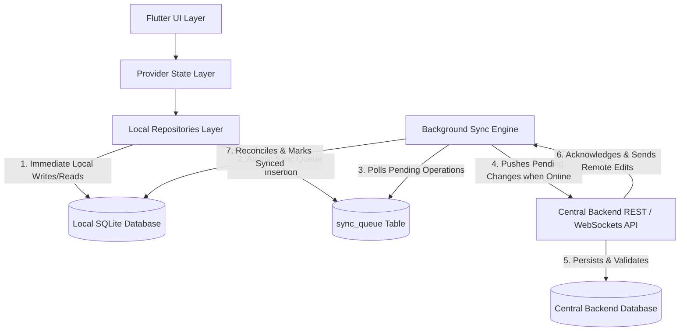

# BlackVault — Phase 8.1: Offline-First Architecture & Sync Model Specification

---

## Executive Overview

This document specifies the **Offline-First Architecture & Synchronization System** for **BlackVault**, building directly upon the Phase 7 SQLite database foundation (`blackvault.db`).

BlackVault operates under the fundamental principle:
> **Local SQLite remains the application's primary operational database on the device.**

The Flutter application executes all reads and writes immediately against local SQLite, providing instant user interface feedback and full offline functionality. Synchronization with the central backend operates asynchronously in the background whenever network connectivity is available.

---

## 1. Current Phase 7 Architecture (Grounded Analysis)

### 1.1 Local SQLite Database (`DatabaseService`)
- **Location**: [`lib/services/database_service.dart`](file:///d:/LOAN_REQUEST_AG/lib/services/database_service.dart)
- **Database File**: `blackvault.db` (Version 1)
- **Platform Initialization**: Uses native `sqflite` on mobile (Android/iOS) and `sqflite_common_ffi` on desktop (Windows, macOS, Linux).
- **Core Schema**:
  - `users`: `id`, `fullName`, `email`, `phone`, `role`, `passwordHash`, `createdAt`
  - `loans`: `id`, `userId`, `userName`, `amount`, `tenureMonths`, `purpose`, `priority`, `status`, `createdAt`
  - `loan_activities`: `id`, `loanId`, `userId`, `userName`, `type`, `message`, `createdAt`
  - `notifications`: `id`, `userId`, `title`, `message`, `type`, `loanId`, `createdAt`, `isRead`
  - **Indexes**: `idx_loans_userId`, `idx_loans_status`, `idx_loan_activities_loanId`, `idx_loan_activities_userId`, `idx_notifications_userId`, `idx_notifications_loanId`.

### 1.2 Persistence Repositories & Data Flow
- **`LocalLoanRepository`** ([`lib/repositories/loan_repository.dart`](file:///d:/LOAN_REQUEST_AG/lib/repositories/loan_repository.dart)): SQLite CRUD operations (`getAllLoans`, `getUserLoans`, `getLoanById`, `createLoan`, `updateLoanStatus`, `deleteLoan`). Seed data (`LOAN-1001`, `LOAN-1002`) initializes automatically on fresh databases.
- **`LocalLoanActivityRepository`** ([`lib/repositories/loan_activity_repository.dart`](file:///d:/LOAN_REQUEST_AG/lib/repositories/loan_activity_repository.dart)): Append-only activity logs stored in `loan_activities`.
- **`LocalNotificationRepository`** ([`lib/repositories/notification_repository.dart`](file:///d:/LOAN_REQUEST_AG/lib/repositories/notification_repository.dart)): System & loan notifications stored in `notifications` with `isRead` integer mapping (`0` / `1`).
- **`MigrationService`** ([`lib/services/migration_service.dart`](file:///d:/LOAN_REQUEST_AG/lib/services/migration_service.dart)): One-time atomic migration from legacy `SharedPreferences` JSON strings into SQLite.

### 1.3 State Management & Callers
- **`LoanProvider`** ([`lib/providers/loan_provider.dart`](file:///d:/LOAN_REQUEST_AG/lib/providers/loan_provider.dart)): Orchestrates business actions (`createLoan`, `updateLoanStatus`, `cancelLoan`) across `LoanRepository`, `LoanActivityRepository`, and `NotificationRepository`.
- **Current Offline Behavior**: 100% functional on a single device using local SQLite.
- **Current Limitations**: No central backend synchronization exists. Data created on Device A (e.g. customer loan request) is isolated locally and not visible to Admin or other devices. Admin status approvals are local to that device.

---

## 2. Target Phase 8 Offline-First Architecture



### Layer Responsibilities

1. **Flutter UI & Provider Layer**:
   - Renders application screens instantly from local Provider state.
   - Remains completely unaware of network connectivity or synchronization delays.
2. **Local Repositories Layer**:
   - Performs immediate SQLite reads and writes.
   - Enqueues outgoing operations into `sync_queue` atomically during business writes.
3. **Local SQLite Database (`blackvault.db`)**:
   - Primary operational database on the device.
   - Contains business tables + `sync_queue` metadata table.
4. **Background Sync Engine**:
   - Monitors network connectivity using `connectivity_plus` / HTTP heartbeats.
   - Pulls pending operations from `sync_queue`, batches requests, and calls Backend API.
   - Receives server-side updates and applies them transactionally to local SQLite tables.
5. **Central Backend & Database**:
   - Central authority for cross-device data validation, identity verification, authorization, and broadcast updates to other connected devices/admin panels.

---

## 3. Entity Ownership Matrix

| Entity | Stored in Local SQLite | Stored in Server Backend | Primary Entity Owner | Sync Direction | Conflict Authority |
| :--- | :--- | :--- | :--- | :--- | :--- |
| **Customer Profile** | Yes (`users` table / session) | Yes | Customer | Bidirectional | Customer (profile) / Server (roles) |
| **Loan Application Fields** (`amount`, `tenureMonths`, `purpose`, `priority`) | Yes (`loans` table) | Yes | Customer | Device → Server (when `pending`) | Customer Device (if status is `pending`) |
| **Loan Application Status** (`status`) | Yes (`loans.status`) | Yes | Admin / Management | Server → Customer Device | **Server / Admin ALWAYS Overrides** |
| **Loan Activity Log** | Yes (`loan_activities` table) | Yes | System / Admin / Customer | Bidirectional (Append-Only) | Merge by `createdAt` timestamp |
| **Notifications** | Yes (`notifications` table) | Yes | Server (creation) / Customer (`isRead`) | Bidirectional | Server (creation) / Customer (`isRead` state) |

---

## 4. Synchronization States

Each local record and sync operation moves through explicit, well-defined lifecycle states:

```
  [User Action Offline]
           │
           ▼
     ┌───────────┐
     │ LOCAL_ONLY│  (Created offline, pending initial server push)
     └─────┬─────┘
           │ Network Connected
           ▼
     ┌───────────┐
     │SYNCING    │  (In flight to backend API)
     └─────┬─────┴────────┐
           │              │
    Server Acknowledged  Server Error / Offline
           │              │
           ▼              ▼
     ┌───────────┐  ┌───────────┐
     │  SYNCED   │  │SYNC_FAILED│ ──(Retry with backoff)──► SYNCING
     └───────────┘  └───────────┘
```

### Detailed State Definitions

1. **`LOCAL_ONLY`**:
   - **Meaning**: Record created on the device while offline. Assigned a client-generated UUID.
   - **Transitions**: Created by local repository write -> Transitions to `SYNCING` when network engine initiates upload.
2. **`PENDING_SYNC`**:
   - **Meaning**: Existing synced record modified locally (or queued operation waiting for network window).
   - **Transitions**: Local edit -> Transitions to `SYNCING` upon transmission attempt.
3. **`SYNCING`**:
   - **Meaning**: Operation actively being transmitted to the central backend.
   - **Transitions**: Enters from `LOCAL_ONLY`, `PENDING_SYNC`, or `SYNC_FAILED`. Moves to `SYNCED` on HTTP `200/201 OK`, or `SYNC_FAILED` on network/server error.
4. **`SYNCED`**:
   - **Meaning**: Local record state is identical to server authoritative state.
   - **Transitions**: Enters upon server acknowledgment or server pull insertion.
5. **`SYNC_FAILED`**:
   - **Meaning**: Transmission failed due to network loss, timeout, or server 5xx error.
   - **Transitions**: Enters from `SYNCING`. Retried automatically using exponential backoff back to `SYNCING`.
6. **`CONFLICT`**:
   - **Meaning**: Server rejected change due to business rule validation or concurrent edit.
   - **Transitions**: Enters from `SYNCING` on HTTP `409 Conflict`. Resolved via Field Ownership Rules (e.g. Admin status override) transitioning to `SYNCED`.

---

## 5. Identity Strategy & Multi-Device Collision Prevention

### 5.1 Globally Unique Identifiers (UUID v4)
- Current local IDs (e.g. `LOAN-1001`, `LOAN-1002`, `NOTIF-1`) are supplemented/replaced with **UUID v4** strings (e.g. `550e8400-e29b-41d4-a716-446655440000` or prefixed `LOAN-550e8400-e29b-41d4-a716-446655440000`).
- **Why Auto-Increment / Short IDs are Insufficient**: If Device A creates `LOAN-1003` offline and Device B creates `LOAN-1003` offline, uploading both to the central server causes primary key collisions. UUID v4 guarantees global uniqueness across independent offline devices without central coordination.

### 5.2 Device Identifier (`deviceId`)
- Generated on first app launch using UUID v4.
- Stored persistently in `SharedPreferences` (`key_device_id`).
- Attached to all sync request headers (`X-Device-ID: <deviceId>`).
- **Purpose**: Server includes `originDeviceId` in WebSocket / Pull responses so the originating device ignores its own pushed changes during pull reconciliation (echo prevention).

---

## 6. Synchronization Metadata Schema

To maintain clean separation between domain models and synchronization concerns, metadata is stored directly in SQLite tables:

| Metadata Field | Belongs To | Data Type | Purpose / Description |
| :--- | :--- | :--- | :--- |
| `id` | Domain / Sync | `TEXT PRIMARY KEY` | Globally unique UUID v4 identifier. |
| `serverId` | Sync Layer | `TEXT` | Server-assigned database ID (if different from client UUID). |
| `deviceId` | Sync Layer | `TEXT` | ID of the device that created/modified the record. |
| `syncStatus` | Sync Layer | `TEXT` | `LOCAL_ONLY`, `PENDING_SYNC`, `SYNCING`, `SYNCED`, `SYNC_FAILED`, `CONFLICT`. |
| `createdAt` | Domain / Sync | `TEXT (ISO-8601)` | Timestamp when the record was created locally. |
| `updatedAt` | Domain / Sync | `TEXT (ISO-8601)` | Timestamp when record fields were last modified. |
| `lastSyncedAt` | Sync Layer | `TEXT (ISO-8601)` | Timestamp of last successful server acknowledgment. |
| `version` | Sync Layer | `INTEGER` | Monotonically increasing version number for optimistic concurrency control. |
| `isDeleted` | Sync Layer | `INTEGER (0/1)` | Soft deletion flag allowing deletion sync across devices. |

---

## 7. Sync Queue Table Architecture (`sync_queue`)

Offline mutations are tracked using a dedicated, persistent SQLite table: `sync_queue`.

### 7.1 Schema Definition
```sql
CREATE TABLE IF NOT EXISTS sync_queue (
  id TEXT PRIMARY KEY,
  entityType TEXT NOT NULL,         -- 'loan', 'loan_activity', 'notification'
  entityId TEXT NOT NULL,           -- Target entity primary key
  operation TEXT NOT NULL,          -- 'CREATE', 'UPDATE', 'DELETE'
  payload TEXT NOT NULL,            -- JSON serialized string of operation data
  clientOperationId TEXT NOT NULL,  -- Unique key for backend idempotency
  createdAt TEXT NOT NULL,          -- Timestamp queued
  retryCount INTEGER NOT NULL DEFAULT 0,
  lastAttemptAt TEXT,
  status TEXT NOT NULL DEFAULT 'PENDING_SYNC', -- 'PENDING_SYNC', 'SYNCING', 'SYNC_FAILED'
  error TEXT
);

CREATE INDEX IF NOT EXISTS idx_sync_queue_status ON sync_queue(status);
CREATE INDEX IF NOT EXISTS idx_sync_queue_createdAt ON sync_queue(createdAt);
```

### 7.2 Queue Lifecycle & Retry Mechanics
1. **Enqueue**: During business operations (e.g. `createLoan`), an entry is inserted into `sync_queue` in the **same SQLite transaction** as the business record update.
2. **Processing**: When connectivity is active, the `SyncEngine` queries `SELECT * FROM sync_queue WHERE status IN ('PENDING_SYNC', 'SYNC_FAILED') ORDER BY createdAt ASC`.
3. **Execution**: Operation status is marked `SYNCING` and sent to the REST API.
4. **Completion**: Upon HTTP `200/201 OK`, the queue entry is deleted from `sync_queue` (or marked completed) and the target entity's `syncStatus` is updated to `SYNCED`.
5. **Retry Handling**: On failure, `retryCount` is incremented, `lastAttemptAt` is updated, `status` becomes `SYNC_FAILED`, and retries execute using **exponential backoff** ($2^n \times 5$ seconds, capped at 15 minutes).

---

## 8. Complete Synchronization Lifecycle

```
[User Action in UI]
       │
       ▼
[SQLite Transaction] ──(1. Save Entity)───────► [loans / activities / notifications Table]
       │
       └───(2. Save Queue Entry)──► [sync_queue Table (status: PENDING_SYNC)]
       │
[UI Updates Instantly]
       │
[Network Connection Restored]
       │
       ▼
[SyncEngine Background Task]
       │
       ├──► Sets queue status to SYNCING
       ├──► POST /api/v1/sync/push (Payload + clientOperationId + X-Device-ID)
       │
  ┌────┴────────────────────────┐
  ▼                             ▼
[Server Validation OK]    [Network Error / Timeout]
  │                             │
  ├──► 200 OK Received          ├──► Increment retryCount
  ├──► Delete sync_queue entry  ├──► Set status = SYNC_FAILED
  ├──► Mark entity SYNCED       └──► Schedule Exponential Backoff Retry
  │
  ▼
[SyncEngine Pull Phase]
  │
  ├──► GET /api/v1/sync/pull?since=<lastSyncedAt>
  ├──► Apply server updates to local SQLite transactionally
  └──► Update lastSyncedAt timestamp
```

---

## 9. Conflict Resolution Strategy (Field-Level Ownership)

BlackVault avoids naive "Last Write Wins" by enforcing **Field Ownership Rules**:

### 9.1 Ownership Matrix Rules
1. **Customer-Owned Fields** (`amount`, `tenureMonths`, `purpose`, `priority`):
   - Customer devices have authority.
   - If the application `status` is `pending`, customer edits uploaded from offline devices overwrite server values.
2. **Admin-Owned Fields** (`status`):
   - Backend / Admin actions have **absolute authority**.
   - If an Admin approves (`status = approved`) or rejects (`status = rejected`) a loan on the server, a customer's offline cancellation or edit request for that loan is rejected by the server with `409 Conflict`. The client database accepts the Admin's final `status`.
3. **Append-Only Event Logs** (`loan_activities`, `notifications`):
   - Activities and notifications are immutable append-only logs.
   - Merged across devices by unique `id` and `createdAt` timestamps.

---

## 10. Transaction Safety Rules

To guarantee that a local business update is **never permanently unsynchronized**, SQLite transactions must encompass both business table updates and `sync_queue` entries atomically:

```dart
// Conceptual Transaction Pattern for Repositories in Phase 8
await db.transaction((txn) async {
  // 1. Update business table
  await txn.insert('loans', loan.toJson(), conflictAlgorithm: ConflictAlgorithm.replace);

  // 2. Insert sync queue operation atomically
  await txn.insert('sync_queue', {
    'id': 'QUEUE-${UUID.v4()}',
    'entityType': 'loan',
    'entityId': loan.id,
    'operation': 'CREATE',
    'payload': jsonEncode(loan.toJson()),
    'clientOperationId': 'OP-${UUID.v4()}',
    'createdAt': DateTime.now().toIso8601String(),
    'status': 'PENDING_SYNC',
  });
});
```

If the device powers off or crashes mid-write, **both** operations roll back together, maintaining perfect consistency.

---

## 11. Idempotency Strategy (`clientOperationId`)

To prevent duplicate requests when network retries occur (e.g., client sends upload, server processes and saves record, but HTTP response drops before reaching client):

1. **Client Generation**: Each queue operation generates a unique `clientOperationId` (UUID v4).
2. **Transmission**: Sent in the payload of every HTTP request.
3. **Server Validation**: The central backend stores processed `clientOperationId` entries in a deduplication cache/table.
4. **Duplicate Handling**: If the server receives a request with an already-processed `clientOperationId`, it skips re-inserting the record and returns `200 OK` with the cached result.

---

## 12. Network Failure & Edge-Case Fault Tolerance

| Scenario | Application Behavior |
| :--- | :--- |
| **No Internet** | Local write succeeds instantly in SQLite. Operation queued as `PENDING_SYNC`. UI functions normally. |
| **Intermittent / Poor Signal** | Request times out. `SyncEngine` catches timeout, sets queue status `SYNC_FAILED`, and schedules exponential backoff. |
| **Connection Drops Mid-Upload** | Server may or may not have received request. Retry uses same `clientOperationId` so server deduplicates safely. |
| **Connection Drops Mid-Download (Pull)** | Client SQLite transaction has not committed pull batch. Rollback occurs cleanly; next pull resumes from previous `lastSyncedAt`. |
| **Server 500 / Unavailable** | Queue item marked `SYNC_FAILED`. Local data preserved. Exponential backoff delays next attempt. |
| **Device Restart / App Killed** | Queue items persist in SQLite `sync_queue` table across restarts and resume automatically on next boot. |

---

## 13. Security & Authorization Architecture

1. **Authentication**: JWT access tokens & refresh tokens stored securely.
2. **Customer Data Isolation**: Backend enforces row-level security: Customers can only query/sync loans where `userId == token.userId`.
3. **Admin Authorizations**: Only JWT tokens with `role == 'admin'` can mutate loan `status` to `approved` or `rejected`.
4. **TLS Encrypted Transport**: All sync traffic transmitted strictly over `HTTPS` / `WSS`.
5. **Device Identity**: `deviceId` identifies the physical installation but is never used as an authentication credential.

---

## 14. Phase 8 Implementation Roadmap

- **Phase 8.1**: Architecture & Sync Model Specification (Documentation).
- **Phase 8.2 — Backend Foundation**: REST API & Database setup for central backend (Users, Loans, Activities, Notifications, Argon2id, JWT, Sync endpoints).
- **Phase 8.3 — Local Sync Queue**: Added `sync_queue` table to `DatabaseService` schema (version 2 with migration), created `LocalSyncQueueRepository` & `SyncQueueItem` model, and updated local repositories (`LocalLoanRepository`, `LocalLoanActivityRepository`, `LocalNotificationRepository`) to record mutations atomically inside SQLite transactions.
- **Phase 8.4 — Push Synchronization**: Created `SyncEngine` in `lib/services/sync_engine.dart` and implemented `SyncBackendController` at `POST /api/sync/push`. Enforces `clientOperationId` idempotency, role-based access control, and field ownership validation.
- **Phase 8.5 — Pull Synchronization**: Created monotonically increasing `serverVersion` sequence in `sync_changes` table, implemented `GET /api/sync/pull` endpoint with data isolation and pagination, added `sync_metadata` table for local cursor persistence (`lastAppliedServerVersion`), updated `SyncEngine.pullChanges()`, and prevented echo loops.
- **Phase 8.6 — Conflict Resolution**:
  - **Phase 8.6.1 — Audit & Design (Completed)**: Created comprehensive conflict resolution specification (`docs/conflict_resolution.md`), field ownership matrix, status transition rules, and 9-category conflict taxonomy.
  - **Phase 8.6.2 — Persistence & Concurrency Foundation (Completed)**: Entity-level versioning (`loans.version`), base version tracking (`baseVersion`), server-side stale push detection (`HTTP 409 CONFLICT` with `serverState`), and SQLite `sync_conflicts` table schema (v3 migration) with atomic evidence persistence.
  - **Phase 8.6.3+ — Merge Engine**: Field-level merge algorithm and conflict resolution handlers.
- **Phase 8.7 — Reliability & Recovery**: Implement network loss detection, exponential backoff retries, and offline queue recovery.
- **Phase 8.8 — End-to-End Testing**: Multi-device integration tests, offline-to-online transition tests, and regression verification.
